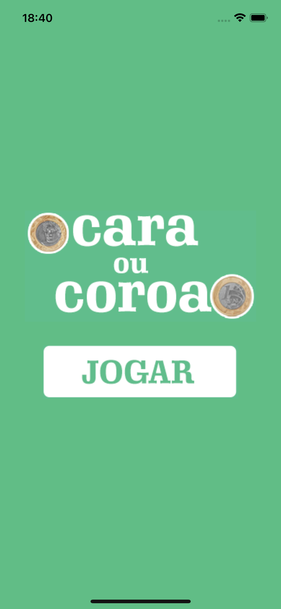
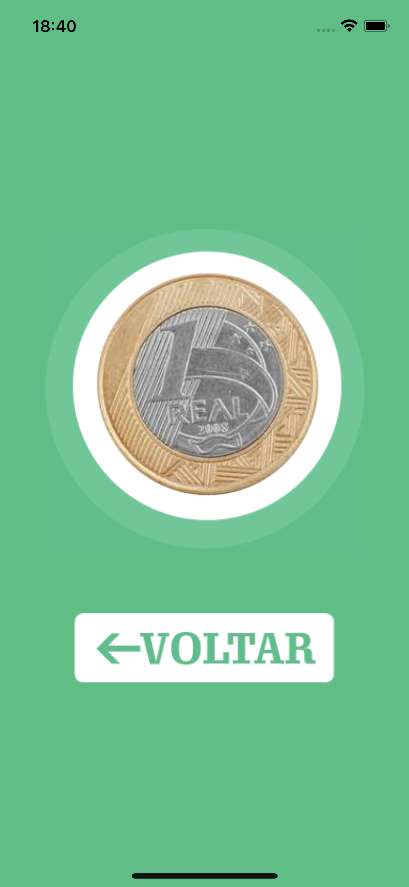
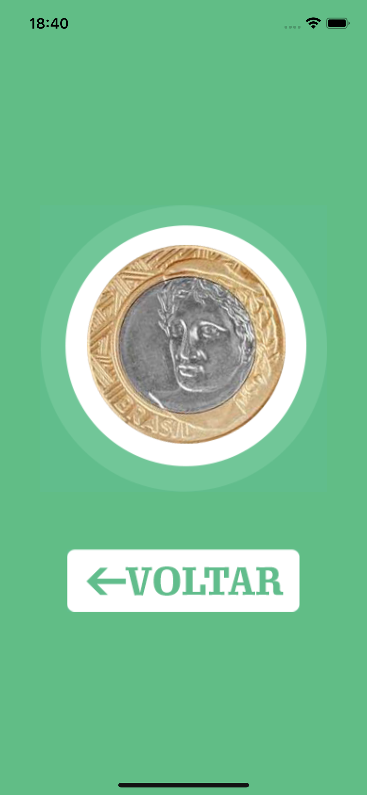

# App Cara ou Coroa

## Descrição

Um aplicativo simples com o jogo cara ou coroa desenvolvido durante o curso de Desenvolvimento Flutter Mobile.

## Curso

**Desenvolvimento Android e IOS com Flutter - Crie 15 Apps**

[Link para o curso na Udemy](https://www.udemy.com/course/desenvolvimento-android-e-ios-com-flutter/?couponCode=MCLARENT71824)

## Status do Projeto

- **Concluído:** 12/10/2021
- **Atualizado:** 30/07/2024

## Tecnologias Utilizadas


## Funcionalidades

- Tela inicial
- Jogar
- Resultado

## Instalação

Siga os passos abaixo para rodar o projeto localmente:

1. Clone o repositório:
    ```sh
    git clone https://github.com/rafaelleonan/app-flutter-cara-ou-coroa.git
    ```
2. Navegue até o diretório do projeto:
    ```sh
    cd app-flutter-cara-ou-coroa
    ```
3. Instale as dependências:
    ```sh
    flutter pub get
    ```
4. Execute o aplicativo:
    ```sh
    flutter run
    ```

## Telas
<p>
  
  
  
</p>

## Video Demonstração
[Assista o vídeo](https://uca09b54eb5c2d9324ef17a69e40.dl.dropboxusercontent.com/cd/0/inline/CXyzdIRHSISWsGCkjZmJmNypLx8GM3GjGdy2ITFlCbx-UnXGOpxZBs8tqMeM41oJrkUO0LxmjWuqM7_zjXx1TN2w1WFyH6PvWRVIMxTC8s_3tujUdoN3Aw-Zu8C20sWzhcpPAve_IWWO1pyyL_5qSfJ8/file#)
